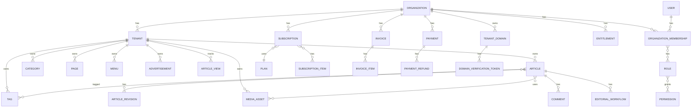

# Entity Relationship Diagram

```mermaid
erDiagram
    ORGANIZATION ||--o{ TENANT : has
    ORGANIZATION ||--o{ ORGANIZATION_MEMBERSHIP : has
    ORGANIZATION ||--o{ SUBSCRIPTION : has
    ORGANIZATION ||--o{ INVOICE : has
    ORGANIZATION ||--o{ PAYMENT : has
    ORGANIZATION ||--o{ ENTITLEMENT : has
    ORGANIZATION ||--o{ TENANT_DOMAIN : owns
    TENANT ||--o{ ARTICLE : owns
    TENANT ||--o{ CATEGORY : owns
    TENANT ||--o{ TAG : owns
    TENANT ||--o{ MEDIA_ASSET : owns
    TENANT ||--o{ PAGE : owns
    TENANT ||--o{ MENU : owns
    TENANT ||--o{ ADVERTISEMENT : owns
    TENANT ||--o{ ARTICLE_VIEW : tracks
    USER ||--o{ ORGANIZATION_MEMBERSHIP : has
    ORGANIZATION_MEMBERSHIP }o--o{ ROLE : has
    ROLE }o--o{ PERMISSION : grants
    ARTICLE }o--o{ TAG : tagged
    ARTICLE ||--o{ ARTICLE_REVISION : has
    ARTICLE }o--o{ MEDIA_ASSET : uses
    ARTICLE ||--o{ COMMENT : has
    ARTICLE ||--o{ EDITORIAL_WORKFLOW : has
    SUBSCRIPTION }o--|| PLAN : uses
    SUBSCRIPTION }o--o{ SUBSCRIPTION_ITEM : has
    INVOICE ||--o{ INVOICE_ITEM : has
    PAYMENT ||--o{ PAYMENT_REFUND : has
    TENANT_DOMAIN ||--o{ DOMAIN_VERIFICATION_TOKEN : has
```
